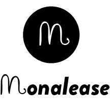

# Mona Lease

A dApp for self-executing rental agreements paid in Ethereum.





Used by Co-working spaces.  
(live trials beginning 2018 Q3)


## Development

#### Install

```
$ npm install
```


#### Build and Deploy

First start up a chain running on port *8545*, Ganache is recommended, a la:

```
$ ganache-cli -p 8545 -m oil snack powder kiwi exhibit clay rate table famous behind final river
```

```
$ truffle compile
```

#### Run

Note that a web3 enabled browser (such as Chrome with Metamask) is required to run the dApp

```
$ npm start  
```

#### Unit tests

```
$ truffle test
```


## Live Instance

**TODO** a "live" instance is currently being deployed   
the notes about that will be put here once that has been done

#### Code Cave Maleny 

**TODO** add link to the code cave Maleny live demo (running on Ropsten initially ..?)


